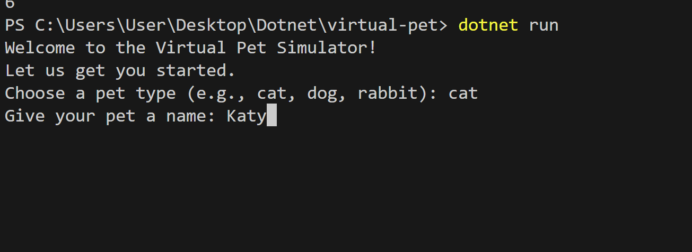
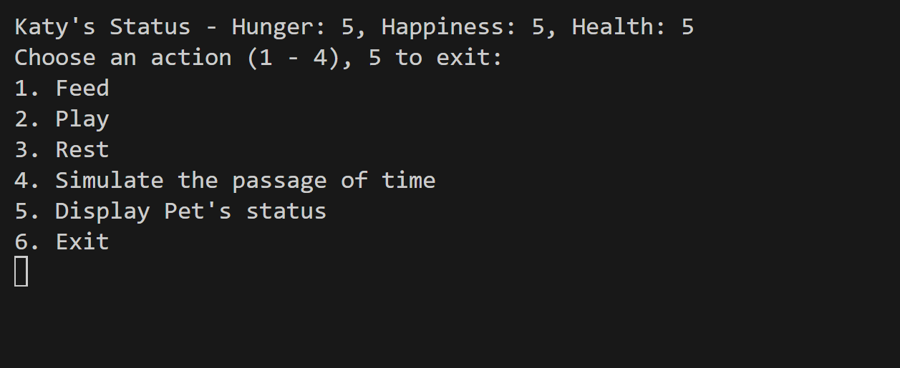
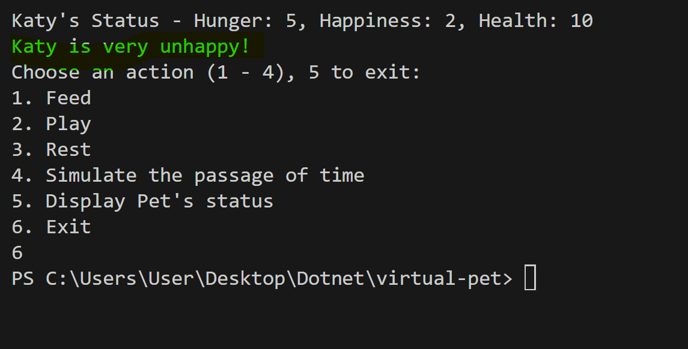

# virtual-pet
A virtual pet simulator created in C#

### How to run program
Run the following commands in order:
 
 ```bash 
PS C:\folder-to-app> dotnet build
 ```
  ```bash 
PS C:\folder-to-app> dotnet run
 ```


After that you should get a welcome screen prompting you to enter the name and type of your pet like this:



After that you should have options to interact with the virtual pet like this:



You can interact with the virtual pet by inputing 1 - 5, you can choose to exit by inputing 6.


The status of the pet is always displayed on the of the console as shown below, the highlighted text is the status that is shown when your virtual pet has an extreme condition in either health, hunger or happiness.
